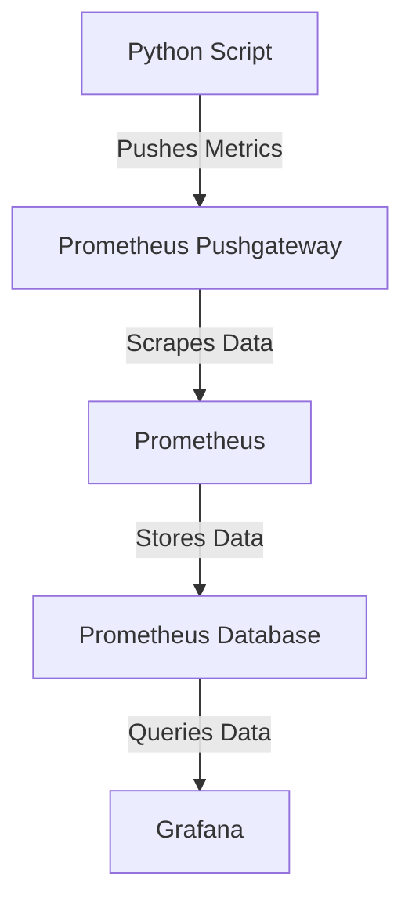

# mt681-sml-obis-parser
This small tool parses the data coming via IR from my MT681 power meter and pushes them to [Prometheus Pushgateway](https://github.com/prometheus/pushgateway)  Prometheus will then be able to scrape the data from the /metrics endpoint. I then use this data for Dashboards in Grafana

